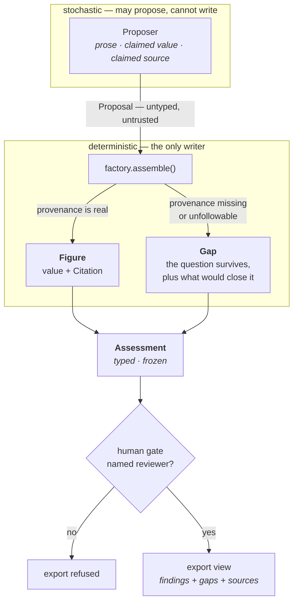

# Provenance by construction

A small, self-contained reference implementation of one idea:

> **Make an unsourced number impossible to produce, rather than trying to catch it later.**

A language model will happily emit `ROI: 3.2x`. That number is unsourced, unreproducible, and
indistinguishable from a real one. For a technical reviewer, an unsourced number is *worse* than
no number — it looks decision-grade.

The usual response is a review step: a checklist, a linter, a prompt telling the model to always
cite its sources. Those are **behavioural** controls. They work when everyone remembers and fail
quietly when someone does not. Accuracy is a probability.

## Stack

Deliberately small. The guarantee lives in the type system, so there is very little else to
have an opinion about — and a reader should be able to hold the whole thing in their head.

| Layer | Choice | Why this one |
|---|---|---|
| Language | Python ≥ 3.11 | union syntax, `from __future__ import annotations` |
| Contract | **Pydantic v2** — `frozen=True`, `extra="forbid"` | validation runs at *construction*, so an invalid object never exists rather than being caught later |
| Core | plain functions, no framework | the enforcement is in the model; an orchestration layer would only add places to bypass it |
| Model layer | none — scripted stub proposer | the *boundary* is the subject; nothing on the far side needs to move for it to be legible |
| Tests | **pytest** | mostly negative tests — the claim is about what the system refuses |
| Export | stdlib `html` only | a renderer with no ability to fetch or compute cannot add a number |
| Dependencies | `pydantic` | one runtime dependency, on purpose |

## How it fits together



Two things the diagram is making explicit. **The arrow into the core only goes one way** — the
stochastic layer has no path to the record, so a hallucinated number cannot become a quiet
error in the output; it becomes a rejection with a reason. And **rejections do not vanish** —
they leave a gap, because a record that silently drops what it could not source looks identical
to one where nothing was wrong.

This repository demonstrates the **structural** alternative. The type that carries a number
requires provenance in order to exist:

```python
>>> Figure(label="annual damage", value=2_400_000.0, unit="USD/yr")
ValidationError: citations — List should have at least 1 item

>>> Figure(label="basin area", value=19_500.0, unit="sq mi", citations=[usgs])
Figure(...)                                     # fine — it can be followed
```

There is no argument list that produces the first object. Not a warning, not a lint rule you can
disable — the object cannot be built. Impossibility is a guarantee.

## The shape

```
proposals ──▶ deterministic core ──▶ record ──▶ human gate ──▶ export
(untyped,       (the only writer)    (typed,      (named        (refuses
 untrusted)                          frozen)      reviewer)     unreviewed)
```

- **`proposer.py`** — the stochastic boundary. Stands in for a model, a search tool, an analyst.
  It emits claims. It *cannot* construct a `Figure` and *cannot* write to the record, so the
  worst a bad proposal can do is fail validation with a stated reason.
- **`factory.py`** — the deterministic core, and the only thing that assembles a record. It
  admits what it can source, rejects what it cannot, and turns every rejection into a visible
  **gap**. A pipeline that silently discards bad input produces a clean-looking record whose
  cleanliness is a lie.
- **`models.py`** — the contract. `Figure` needs a citation; a *computed* figure also needs a
  derivation naming its inputs, so lineage resolves down to observed, cited values.
- **`gate.py`** — human review as a *state*, not an assumption. An unreviewed record is a
  distinguishable object that downstream code refuses.
- **`render.py`** — an export view. It reads the record and cannot add to it; it prints the open
  gaps alongside the findings, because an export that omits them misrepresents its source.

## Run it

```bash
pip install pydantic
PYTHONPATH=src python examples/wheeler_creek.py     # writes examples/wheeler_creek_output.html
PYTHONPATH=src python -m pytest tests -q
```

The example feeds three proposals through the pipeline: one well sourced, one a confident dollar
figure with no source at all, one citing "a federal flood map" with a link nobody can follow.
Watch which survives, and watch the other two turn into open gaps rather than disappearing.

## Read the tests first

`tests/test_contract.py` is the argument. Most of it asserts that something **fails**, because
the claim is about what the system refuses to do. A README asserting a guarantee proves nothing;
a test that cannot be made to pass proves quite a lot. Try to write one that defeats it.

## Scope — deliberately narrow

This shows a *pattern*, not a product. It has no data sources, no domain model, no scoring, no
opinion about what any number means. Those are the hard parts of any real system, and they are
not what this repository is about.

The demonstration site (**Wheeler Creek Municipal Campus**) is fictional. The cited source is
real and public — USGS site 03086000, Ohio River at Sewickley, PA — so the provenance chain in
the output is genuinely followable while the example asserts nothing about any actual place.

See [`docs/philosophy.md`](docs/philosophy.md) for the reasoning and
[`docs/what-this-is-not.md`](docs/what-this-is-not.md) for the limits.

## License

MIT.
